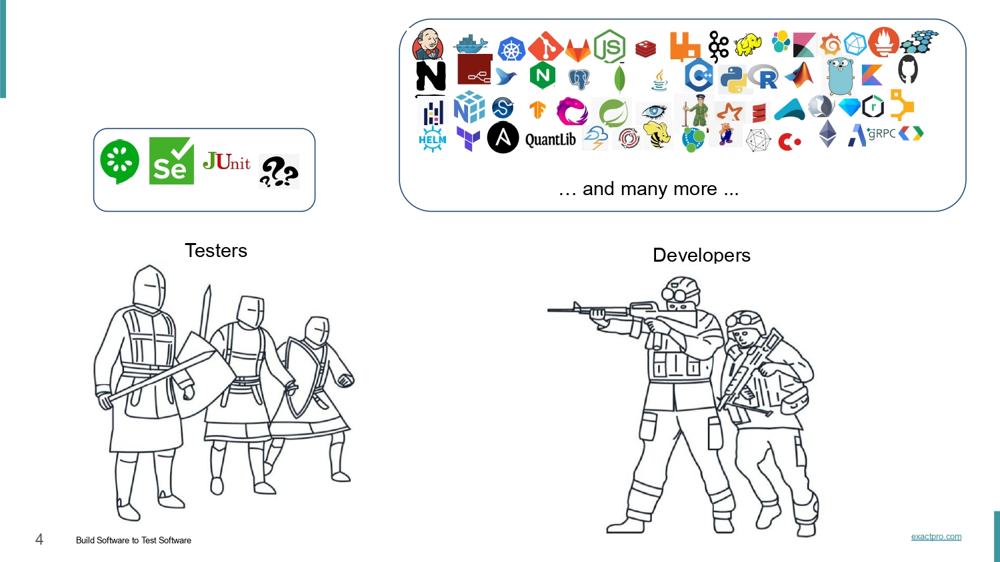
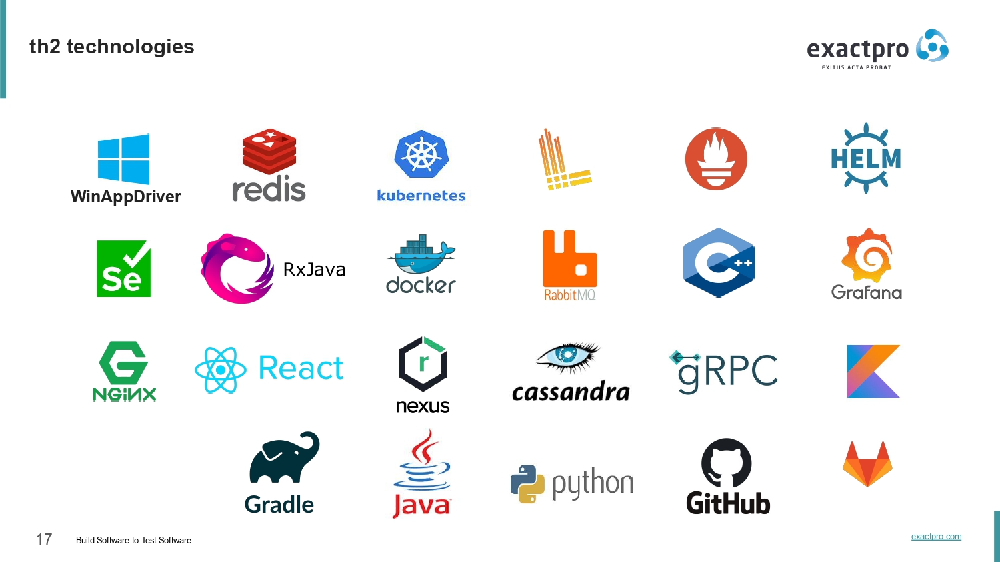
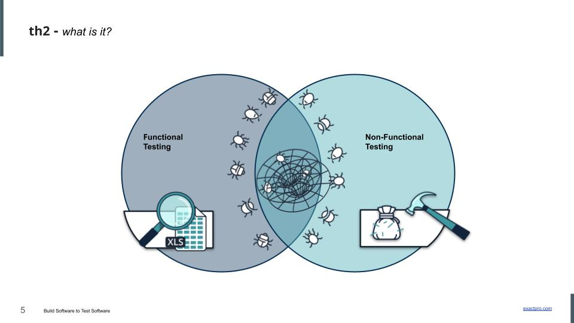
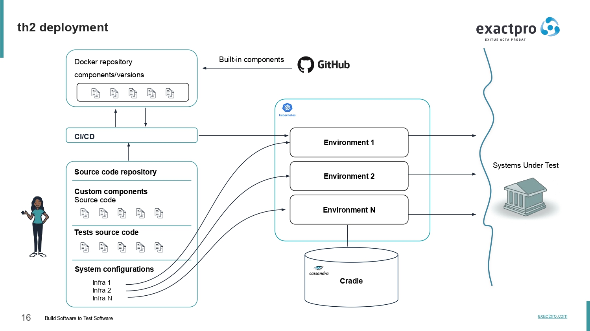
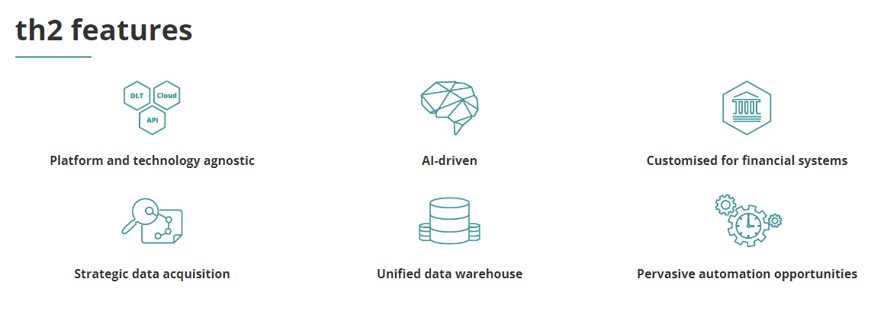

# th2


th2 is the main platform leveraged by the Exactpro team. th2 has already been successfully deployed in a number of use cases. Its first adopter – Airbus' subsidiary Skytra – harnessed the technology for its derivatives trading software; and its most recent implementation was for ML-driven testing of Quod Financial’s technology.

# What is th2?

th2 is a Kubernetes-driven microservices solution that allows implementing a large variety of automated testing techniques and efficiently combining them to deal with very complex test cases and scenarios. It operates by leveraging a technology stack with an open interface, allowing users to adopt digital technology such as the cloud and distributed ledger technology (DLT). It can integrate with a wide range of existing test tools, frameworks, and network protocols to deliver efficient machine-driven end-to-end test libraries with comprehensive coverage of your system.

The th2 toolkit is designed to enable efficient machine learning driven testing for complex distributed transaction processing systems, such as securities trading systems and exchanges, banking, brokerage, post-trade (e.g. clearing, settlement, custody), and payments platforms.

th2 can withstand heavy testing loads, improving test coverage, system quality, and resilience. This is complemented by a range of enhanced data capabilities including faster data processing and unified storage of test results. This provides the ability to perform the analysis of massive amounts of generated test evidence, ensuring regulatory compliance.

We work closely with client teams starting from the initial analysis and design of the test scenarios for the available specifications and system functionality. Thanks to this we got a head start where we were able to implement auxiliary test approaches to reconcile the system's endpoint streams and verify their consistency.

# What is th2 for?

th2 - an attempt to bridge the gap between software development and software testing tools. th2 widely uses many cutting-edge technologies, the core of the platform is available in [open source](https://github.com/th2-net).

th2 offers stock exchanges, clearing houses, central securities depositories (CSDs), and other financial infrastructures a comprehensive end-to-end technology agnostic AI-driven test automation solution in functional and non-functional testing. It aims to help regulated capital markets participants stay compliant and resilient to disruption, while focusing on innovation and having the freedom to embrace emerging technologies most relevant to their clients’ needs. Built with these goals in mind, th2 brings unprecedented flexibility, breadth and depth of software testing to the financial industry.

th2 is a scalable and Resilient way to model, generate, execute and interpret arbitrarily many diverse tests and their permutations against any number of environment configurations, as well as to simulate thousands and millions of messages per seconds, observe and collect traffic and events from various endpoints and store them for human and machine analysis.

# th2 benefits
- The capacity to execute more functional tests under load to improve test coverage, system quality and resilience
- Faster processing of output from massive automated test execution to decrease time to market
- Apt to CI/CD
- Technology stack with an open interface to facilitate the adoption of digital technology (Cloud, DLT)
- Unified storage of distributed test data and results in the Cassandra database to enable better access to test evidence and smart analytics for governance and regulatory compliance
- supports many parallel operations
- th2 can be distributed between several hardware, additional computing power can be quickly involved in testing process it allows to test close to thresholds and exceeding them
- th2 can perform tests written in different programming languages (Python, Java, C++, Kotlin, etc), it allows to storage all the information (source code as well as tests itself) using relevant version control systems
- Executes sophisticated test algorithms
- Performs model-based testing and analyzes the behavior of systems under test
- Integrates with a variety of widely adopted test tools and frameworks via its open interface, using protocols, API, UI, DLT and cloud endpoints

