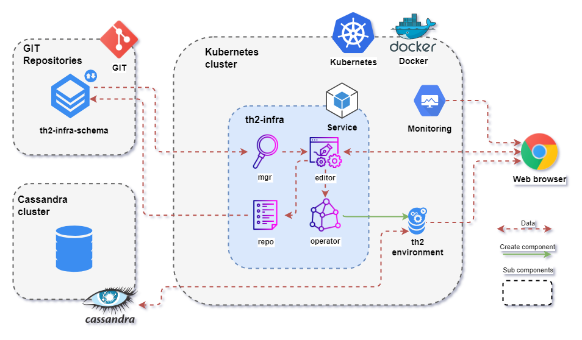

# Install demo example

During this guide you will know how to run th2 in kubernetes cluster and test system with demo example.

Diagram of the final environment presented below.

 

## Contents
1. [Install required software](requirements)
2. [Download th2](download-th2)
3. [Download th2 demo example](get-th2-demo)
4. [Set up cluster](set-up-cluster)
5. [Create th2 environment](create-env)
6. [Get and run demo script](demo-script)
