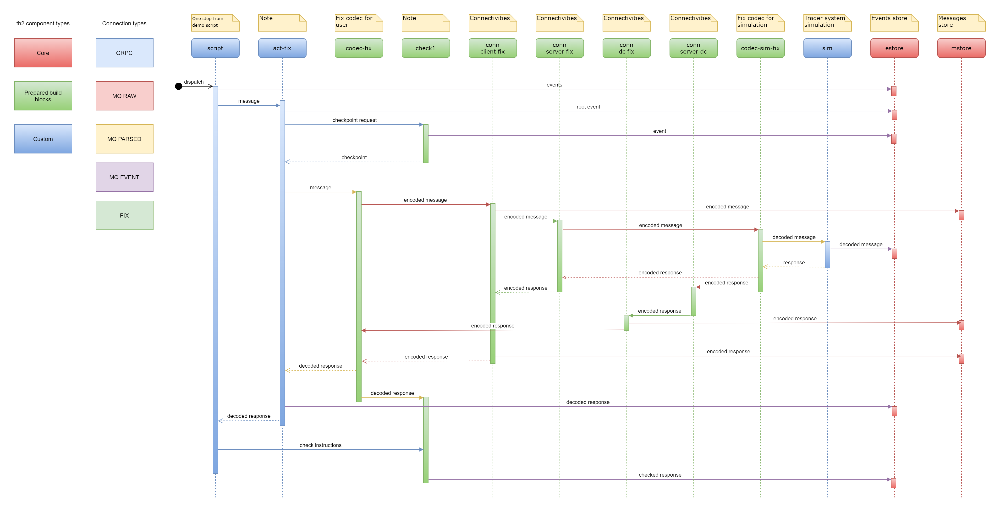

## Demo script scenario
1. User1 submit passive buy order with **Price=x** and **Size=30** - **Order1**
2. User1 receives an Execution Report with **ExecType=0**
3. User1 submit passive buy order with **Price=x+1** and **Size=10** - **Order2**
4. User1 receives an Execution Report with **ExecType=0**
5. User2 submit an aggressive sell IOC (Immediate Or Cancel) order with **price=x-1** and **Size=100** - **Order3**  
   1. User1 receives an Execution Report with **ExecType=F** on trade between **Order2** and **Order3**
   2. User2 receives an Execution Report with **ExecType=F** on trade between **Order3** and **Order2**
   3. User1 receives an Execution Report with **ExecType=F** on trade between **Order1** and **Order3**
   4. User2 receives an Execution Report with **ExecType=F** on trade between **Order3** and **Order1**
   5. User2 receives an Execution Report with **ExecType=C** on expired **Order3**

## Boxes in schema

At step 3, th2-infra-schema was installed.  
Boxes created by th2-infra-schema for demo version are described there.
 

The demo script uses the following boxes:
1. **script** - there demo script is running;
2. **act fix** can initiate FIX message sending;
3. **check1** is needed for data comparison;
4. **codec fix** encrypts and decrypts messages on the client side;
5. **conn client fix** (connectivity client FIX) sends and receives FIX messages on the client side;
6. **conn server fix** (connectivity server FIX) sends and receives FIX messages on the server side;
7. **conn server dc** (connectivity server Drop Copy) replicates FIX messages for one or more participants;
8. **conn dc fix** (connectivity Drop Copy FIX) needed for receiving replicated FIX messages;
9. **codec sim fix** encrypts and decrypts messages on the server side;
10. **sim** (simulation) simulate server activity;
11. **estore** - store for events;
12. **mstore** - store for messages.

## Demo script flow

In this example, **flow** is the path of the one message sent by the _script_.

In the diagram below flow is described in static way.

## th2 reports

There is a web application that can display reports about th2 work.

It can be reached with the URI _http://\<hostname\>:30000/\<schema-namespace\>/_

## Demo script steps

Demo script runs 6 times - with 6 different instruments.

Each run except 6th has 7 steps inside.

First run will be commented there.

### Steps 1, 2

#### Scenario

In the **step 1** _script_ sends request to create passive buy order by user _DEMO-CONN1_.
Order has next parameters:
- Size (_OrderQty_) = 30
- Price = 55 (_x_ | _x_ depends on instrument)

To the end of the **step 1** response message about successfully created order is expected.

In the **step 2** _script_ sends instructions for checking response to the _check1_.

To the end of the **step 2** response be successfully checked by sent instructions is expected.

#### Generated events

Next image contains events within steps 1 and 2 from th2 reports.

Moments of creating these events are demonstrated in "Actual work" section.

There is a possibility to check messages details. It can be very useful.  
For example, details of  _ExecutionReport_ from **step 1**.
Fields _Price_, _OrderQty_ (Size), _Text_ (Comment) can be found here.

_Text_ contains information that this report is about placing order.

#### Actual work in **Step 1**

1. Trader "DEMO-CONN1" sends request to create passive Order.
2. Trader "DEMO-CONN1" receives Execution Report. The order stands on book in status NEW.

_"Received 'ExecutionReport' response message"_ is an expected output in **step 1**.

| Step 1.1 | Step 1.2 | 
|---|---|
|  |  |  

#### Actual work in **Step 2**

1. _Script_ sends instructions for response check to _check1_.
2. _Check1_ analyses response and generates event as the result.

Green _"Check messages"_ is an expected output in **step 2**.

### Steps 3, 4

#### Scenario

In the **step 3** _script_ sends request to create passive buy order by user _DEMO-CONN1_.
Order has next parameters:
- Size (_OrderQty_) = 10
- Price = 56 (_x+1_ | _x_ depends on instrument)

To the end of the **step 3** response message about successfully created order is expected.

In the **step 4** _script_ sends instructions for checking response to the _check1_.

To the end of the **step 4** response be successfully checked by sent instructions is expected.

#### Generated events

Next image contains events within steps 3 and 4 from th2 reports.

#### Actual work in **Step 3**

1. Trader "DEMO-CONN1" sends request to create passive Order with price lower than first order.
2. Trader "DEMO-CONN1" receives Execution Report. The order stands on book in status NEW.

_"Received 'ExecutionReport' response message"_ is an expected output in **step 3**.

| Step 3.1 | Step 3.2 | 
|---|---|
|  |  |  

#### Actual work in **Step 4**

1. _Script_ sends instructions for response check to _check1_.
2. _Check1_ analyses response and generates event as the result.

Green _"Check messages"_ is an expected output in **step 4**.

### Steps 5, 6, 7

#### Scenario

In the **step 5** _script_ sends a request to create aggressive sell IOC order by user _DEMO-CONN2_.
Order has next parameters:
- Size (_OrderQty_) = 100
- Price = 54 (_x-1_ | _x_ depends on instrument)

To the end of the **step 5** response message about successfully trades or 
cancelling order expected, because IOC
cannot be just placed.

There are **2 buy orders** with overall size (30 + 10) not bigger 
than size of the **sell order** (100). Prices of these **buy orders** (55 and 56) are bigger
than price of the **sell order** (54). So trades are happening.

In the **step 6** _script_ sends instructions for checking 
response messages for user _DEMO-CONN1_ to the _check1_.
_DEMO-CONN1_ awaits messages about buying by 2 orders, so there should be only 2 messages.

To the end of the **step 6** response be successfully checked 
**2** messages by sent instructions is expected.

In the **step 7** _script_ sends instructions for checking
response messages for user _DEMO-CONN2_ to the _check1_.
_DEMO-CONN2_ should receive 3 messages:
1. Trade with _DEMO-CONN1_ for Order with Size=30
2. Trade with _DEMO-CONN1_ for Order with Size=10
3. Cancelling not traded Size (100 - 30 - 10 = 60)

To the end of the **step 7** response be successfully checked
**3** messages by sent instructions is expected.

#### Generated events

Next image contains events within steps 5, 6 and 7 from th2 reports.

#### Actual work in **Step 5** 

1. Trader "DEMO-CONN2" sends request to create aggressive IOC Order.
2. Trader "DEMO-CONN1" receives Execution Reports with ExecType=F: first at Order2 and second on Order1.
3. Trader "DEMO-CONN2" receives Execution Reports: first trade with Order2, next with Order1 and then cancellation.

_"Received 'ExecutionReport' response message"_ is an expected output in **step 5**.

| Step 5.1 | Step 5.2/5.3 | 
|---|---|
|  |  |  

#### Actual work in **Step 6**

1. _Script_ sends instructions for response for trader "DEMO-CONN1" check to _check1_.
2. _Check1_ analyses response and generates event as the result.

Green _"Check messages"_ is an expected output in **step 6**.

#### Actual work in **Step 7**

1. _Script_ sends instructions for response for trader "DEMO-CONN2" check to _check1_.
2. _Check1_ analyses response and generates event as the result.

Green _"Check messages"_ is an expected output in **step 7**.

## Searching exceptions
th2 is the **test** tool. So it should be able to catch exceptions. 

To demonstrate this ability _simulator box_ was programmed to create 
exceptions with the specific instruments from the _script_.

_INSTR1_, _INSTR2_, _INSTR3_ work normally. Exceptions from other 
instruments will be described below.

### Instr4

As described in the _Demo script steps_ section,
there should be 3 messages for the seller _DEMO-CONN2_ in the **step 7** of the demo script.

In fact, there are 4 messages. 
The Simulator box sent a redundant execution report message to call an exception.

This information is displayed in the check sequence event details.

In the details of one of filtered messages  
a comment about exception can be found.

### Instr5

The Simulator box sends one message with incorrect values at **step 7** within this run.

Please note that there is a discrepancy between some expected and actual values, 
which prompts the exception message in the th2 report.

### Instr6

In **step 1** within this run, the script sends the message with an unknown _security ID_, which leads to the 
message being rejected.

Message structure:

Exception details:

## Compare results

 
