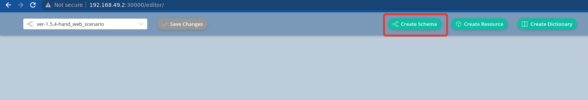
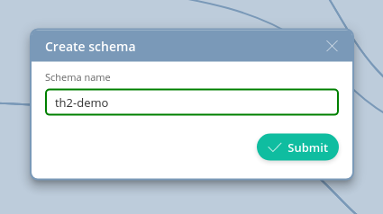
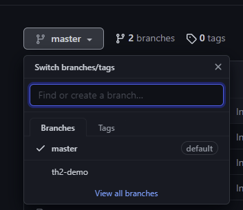
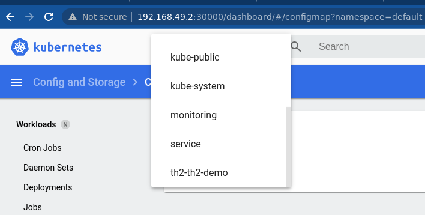

In th2, environment is called `infractructure schema` or just `schema`, it's created by the 
dedicated [infra-mgr](https://github.com/th2-net/th2-infra-mgr) 
component that monitors for changes in the repositories and rolling out schemas from git repository to kubernetes.

{}
You already configured th2-infra-schema 
[in the step 4](/th2-docs/getting-started/install-demo/set-up-cluster/services-config/#set-the-repository-with-schema-configuration).
{}

In demo example all required links between th2 boxes are configured, available 
in the [infra-schema-demo](https://github.com/th2-net/th2-infra-schema-demo) repository and can be used as an example for your new 
components. Additional information on th2-infra configuration can be also found on 
the [infra: Theory of Pins and Links](https://github.com/th2-net/th2-documentation/wiki/infra:-Theory-of-Pins-and-Links) wiki page.

{}
Go to the Infra Editor (`http://your-host:30000/editor/`). And create schema.

Name is needed for creating.

After submitting infra-mgr will create th2-<new_schema_name> namespace and install all needed components.

Infra Editor edit infra schema repository linked to the cluster. That is why SSH key is needed.
For each new schema it creates new branch identical to default branch.

The main action is creating new namespace in kubernetes cluster for new schema.
It will have all components defined in schema.

{}
