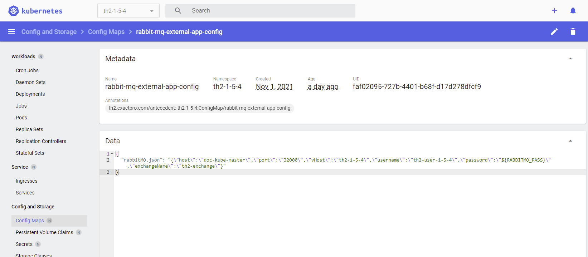

## 0. Get and run simulator boxes

### Clone simulator boxes

Clone [Simulator](https://github.com/th2-net/th2-sim-template) branch for demo script:

```shell
git clone -b demo-ver-1.5.4-local --single-branch https://github.com/th2-net/th2-sim-template.git
```

Clone [Log reader](https://github.com/th2-net/th2-read-log) branch for demo script:

```shell
git clone -b demo-ver-1.5.4-local --single-branch https://github.com/th2-net/th2-read-log.git
```

Clone [CSV reader](https://github.com/th2-net/th2-read-log) branch for demo script:

```shell
git clone -b demo-ver-1.5.4-local --single-branch https://github.com/th2-net/th2-read-csv.git
```

### Change rabbitMQ configmap

{}
Simulator boxes create their own configs from configmaps in kubernetes cluster.

Change `host` value in `rabbit-mq-external-app-config` configmap from to _localhost_ to 
kubernetes cluster hostname.

Execute next command to know the cluster hostname:
```shell
kubectl cluster-info
```
{}

```shell
KUBE_EDITOR="nano" kubectl edit configmap -n <schema-namespace> rabbit-mq-external-app-config -o yaml
```

Configmap before:
```json
{
	"rabbitMQ.json": "{\"host\":\"localhost\",\"port\":\"32000\",\"vHost\":\"th2-th2-demo\",\"username\":\"th2-user-th2-demo\",\"password\":\"${RABBITMQ_PASS}\",\"exchangeName\":\"th2-exchange\"}"
}
```
Configmap after:
```json
{
	"rabbitMQ.json": "{\"host\":\"192.168.49.2\",\"port\":\"32000\",\"vHost\":\"th2-th2-demo\",\"username\":\"th2-user-th2-demo\",\"password\":\"${RABBITMQ_PASS}\",\"exchangeName\":\"th2-exchange\"}"
}
```

### Run simulator boxes

Run CSV reader:
```shell
gradle run --args='--namespace <schema-namespace> --boxName read-csv --contextName $(kubectl config current-context)'
```

Run Log reader:
```shell
gradle run --args='--namespace <schema-namespace> --boxName read-log --contextName $(kubectl config current-context)'
```

Run Simulator:
```shell
gradle run --args='--namespace <schema-namespace> --boxName sim-demo --contextName $(kubectl config current-context)'
```

## 1. Clone the script.

Clone needed branch from the [demo script repository](https://github.com/th2-net/th2-demo-script).  
At the moment of creating guide, actual branch is `ver-1.5.4-main_scenario`

```shell
git clone -b <branch_name> --single-branch https://github.com/th2-net/th2-demo-script.git
```

## 2. Get python environment 3.7+ (e.g. conda).

{}
Python already might be installed after step **1.3.1 Install required software**.
{}

To install Python follow [this instruction](https://wiki.python.org/moin/BeginnersGuide/Download).

Recommended: get IDE to work with python (e.g. pycharm, spyder). You can also start this script from the command line, 
but IDE will make this process more convenient.

## 3. Import the libraries described in requirements.txt
`requirements.txt` contain standart packages to work with grpc (e.g. google-api-core) and custom packages to work 
with th2 boxes. Please note that grpc client (script) and grpc server (th2 box) should use the same package. 
You can find more information about requirements.txt and package installation 
here: https://pip.pypa.io/en/stable/user_guide/#requirements-files

Locate to the script root folder:
```shell
python -m pip install -r requirements.txt
```

## 4. Set up configs
Set up configs from directory configs (mq.json, rabbit.json, grpc.json) according to your components.

{}
Words inside _${value}_ in JSON examples and in dashboard config maps are names of the values, that depends on your cluster.
You must find it by the following instructions.
{}

### grpc.json

Fill host and port fields in grpc.json

```json

{
  "services": {
    "Act": {
      "service-class": "ActService",
      "endpoints": {
        "act": {
          "host": "${NODE_IP}",
          "port": "${ACT_PORT}"
        }
      },
      "strategy": {
        "name": "robin",
        "endpoints": ["act"]
      }
    },
    "Check1": {
      "service-class": "Check1Service",
      "endpoints": {
        "check1": {
          "host": "${NODE_IP}",
          "port": "${CHECK1_PORT}"
        }
      },
      "strategy": {
        "name": "robin",
        "endpoints": ["check1"]
      }
    }
  }
}
```

_NODE_IP_ is IP address of a cluster node.

You can find _CHECK1_PORT_ and _ACT_PORT_ by executing following command.  
{}
Some ports are written in the following style: \<ClusterPort\>:\<NodePort\>/\<Protocol\>.  
For configuration you will need NodePort of appropriate service.
{}
```shell
kubectl get service -n <th2-schema-namespace> 
```

Output example:
```shell
NAME                        TYPE        CLUSTER-IP       EXTERNAL-IP   PORT(S)                         AGE
act-fix                     NodePort    10.104.237.158   <none>        8080:31178/TCP,9752:32434/TCP   19d
act-ui                      NodePort    10.99.109.111    <none>        8080:31356/TCP,9752:30284/TCP   19d
act-ui-backend              NodePort    10.107.95.164    <none>        8080:31357/TCP,9752:31848/TCP   18d
check1                      NodePort    10.111.68.46     <none>        8080:31179/TCP,9752:31099/TCP   19d
........
```

#### Example of **grpc.json**:
```json
{
  "services": {
    "Act": {
      "service-class": "ActService",
      "endpoints": {
        "act": {
          "host": "10.44.16.110",
          "port": 31178
        }
      },
      "strategy": {
        "name": "robin",
        "endpoints": ["act"]
      }
    },
    "Check1": {
      "service-class": "Check1Service",
      "endpoints": {
        "check1": {
          "host": "10.44.16.110",
          "port": 31179
        }
      },
      "strategy": {
        "name": "robin",
        "endpoints": ["check1"]
      }
    }
  }
}
```

### rabbit.json

- host: IP address of a cluster node
- username, password: credentials for rabbitMQ
- vHost, port, exchangeName: Kubernetes Dashboard - Config Maps - rabbit-mq-external-app-config.



```json
{
  "host": "10.44.16.110",
  "vHost": "th2-1-5-4",
  "port": "32000",
  "username": "th2",
  "password": "hkjsdbjfhbhbfk",
  "exchangeName": "th2-exchange"
}
```

### mq.json

Fill mq.json in folder config with RabbitMQ 
exchange and routing key from script-entry-point to estore. 
You can find this queue in Kubernetes Dashboard in Config Maps tab - 
script-entry-point-app-config.


```json
{
  "queues": {
    "event-store-pin": {
      "attributes": [
        "event",
        "publish"
      ],
      "exchange": "th2-exchange",
      "filters": [],
      "name": "key[th2-1-5-4:script-entry-point:estore-pin]",
      "queue": "not_necessary"
    }
  }
}
```

## 5. Run demo script

Finally run demo script.

```shell
sudo python run.py
```

Output example:

```shell
Using th2-common==3.3.6
2021-09-22 16:03:58,632 - asyncio - DEBUG - Using selector: SelectSelector
2021-09-22 16:04:03,336 - root - INFO - Connection established.
2021-09-22 16:04:03,343 - root - INFO - Storing event [TS_1]Aggressive IOC vs two orders: second order's price is lower than first...
.....
2021-09-22 16:04:03,346 - root - INFO - Storing event Case[TC_1.1]: Trader DEMO-CONN1 vs trader DEMO-CONN2 for instrument INSTR1...
.....
2021-09-22 16:04:03,348 - root - INFO - Sending request to act...
description: "STEP1: Trader \"DEMO-CONN1\" sends request to create passive Order."
.....
```
