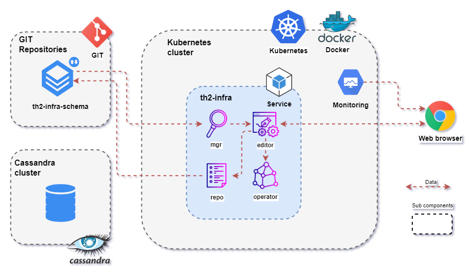

During this step you will deploy th2 into your kubernetes cluster.
At the end of this step your environment setup will be as shown below.



## Deploy th2

{}
Make sure that you are located in the `th2-infra/example-values` directory.
{}

### Install helm-operator

Download helm-operator repository locally

```shell
helm repo add fluxcd https://charts.fluxcd.io
```

Install helm-operator

```shell
helm install --version=1.2.0 helm-operator -n service fluxcd/helm-operator -f ./helm-operator.values.yaml
```

{}
Get helm operator deployment:
```shell
kubectl get deployment -n service -l app=helm-operator
```
Output example:
```shell
NAME            READY   UP-TO-DATE   AVAILABLE   AGE
helm-operator   1/1     1            1           40d
```
{}

### Install NGINX Ingress Controller
Download NGINX Ingress Controller repository locally
```shell
helm repo add ingress-nginx https://kubernetes.github.io/ingress-nginx
```
Install NGINX Ingress Controller
```shell
helm install -n service --version=3.31.0 ingress ingress-nginx/ingress-nginx -f ./ingress.values.yaml
```

{}
Get helm operator deployment:
```shell
kubectl get deployment -n service -l app.kubernetes.io/name=ingress-nginx
```
Output example:
```shell
NAME                               READY   UP-TO-DATE   AVAILABLE   AGE
ingress-ingress-nginx-controller   1/1     1            1           41d
```
{}

### Install Prometheus

Download Prometheus repository locally

```shell
helm repo add prometheus-community https://prometheus-community.github.io/helm-charts
```

Install Prometheus

```shell
helm install --version=15.0.0 prometheus -n monitoring prometheus-community/kube-prometheus-stack -f ./prometheus-operator.values.yaml
```

{}
Get dashboard pod:
```shell
kubectl get pod -n monitoring -l app=kube-prometheus-stack-operator
```
Output example:
```shell
NAME                                                   READY   STATUS    RESTARTS   AGE
prometheus-kube-prometheus-operator-584874d66c-td4hc   1/1     Running   0          41d
```
{}

### Install th2-infra components in the service namespace

Download th2 repository locally

```shell
helm repo add th2 https://th2-net.github.io
```

Install th2


{}
Replace with the th2-infra release version you need, please follow https://github.com/th2-net/th2-infra/releases
{}
```shell
helm install -n service --version=<version> th2-infra th2/th2 -f ./service.values.yaml -f ./secrets.yaml
```

### Install Kubernetes Dashboard

Download [Kubernetes Dashboard](https://kubernetes.io/docs/tasks/access-application-cluster/web-ui-dashboard/) repository locally

```shell
helm repo add kubernetes-dashboard https://kubernetes.github.io/dashboard/
```

Install Kubernetes Dashboard

```shell
helm install dashboard -n monitoring kubernetes-dashboard/kubernetes-dashboard -f ./dashboard.values.yaml
```

{}
Get dashboard pod:
```shell
kubectl get pod -n monitoring -l app.kubernetes.io/name=kubernetes-dashboard
```
Output example:
```shell
NAME                                              READY   STATUS    RESTARTS   AGE
dashboard-kubernetes-dashboard-567678889f-2snh7   1/1     Running   0          40d
```
{}

### Install Grafana

Download Grafana repository locally

```shell
helm repo add grafana https://grafana.github.io/helm-charts
```

Install Grafana

```shell
helm install --version=0.40.1 loki -n monitoring grafana/loki-stack -f ./loki.values.yaml
```

{}
Get dashboard pod:
```shell
kubectl get pod -n monitoring -l app.kubernetes.io/name=grafana
```
Output example:
```shell
NAME                                  READY   STATUS    RESTARTS   AGE
prometheus-grafana-74ff7fcbd4-h2r8t   2/2     Running   0          41d
```
{}

### Check result
#### Pods
Check if service pods are running:
```shell
kubectl get pods -n service
```

Output example:
```shell
NAME                                               READY   STATUS    RESTARTS   AGE
helm-operator-79fc58f746-q8qwd                     1/1     Running   0          21d
infra-editor-7cd68c8587-q5tfp                      1/1     Running   0          20d
infra-mgr-67b65f4bb-gb4cc                          1/1     Running   0          20d
infra-operator-6b7987b55-zxxdt                     1/1     Running   0          20d
infra-repo-9c77fd6f7-xj9wf                         1/1     Running   0          20d
ingress-ingress-nginx-controller-b556b7cb5-gfrhl   1/1     Running   0          22d
rabbitmq-0                                         1/1     Running   0          21d
```

Check if monitoring pods are running
```shell
kubectl get pods -n monitoring
```
Output example:
```shell
NAME                                                     READY   STATUS    RESTARTS   AGE
........
pod/dashboard-kubernetes-dashboard-77d85586db-j9v8f      1/1     Running   0          56s
alertmanager-prometheus-prometheus-oper-alertmanager-0   2/2     Running   0          75s
loki-0                                                   1/1     Running   0          4m47s
loki-promtail-wqfml                                      1/1     Running   0          4m47s
prometheus-grafana-68f8dd6d57-2gtns                      2/2     Running   0          82s
prometheus-kube-state-metrics-75d4cc9dbd-psb88           1/1     Running   0          82s
prometheus-prometheus-node-exporter-gfzp6                1/1     Running   0          82s
prometheus-prometheus-oper-operator-df668d457-snxks      1/1     Running   0          82s
prometheus-prometheus-prometheus-oper-prometheus-0       3/3     Running   1          65s        
........
```
#### Access from browser

Check access to Grafana (the default `user/password: admin/prom-operator` must be changed):  
`http://your-host:30000/grafana/login`.

## Check up installed services

{}
To get the cluster IP (your-host), execute the `kubectl cluster-info` command.
{}

- Kubernetes dashboard `http://your-host:30000/dashboard/`
- Grafana `http://your-host:30000/grafana/`
- th2-infra-editor `http://your-host:30000/editor/`
- RabbitMQ `http://your-host:30000/rabbitmq/`
- th2-reports `http://your-host:30000/your-namespace/`
