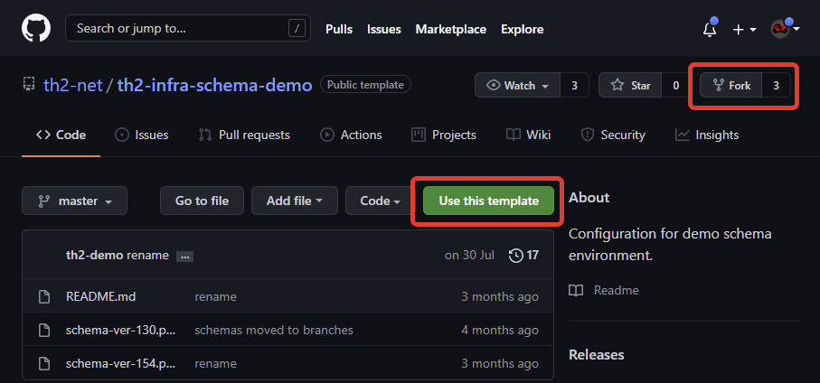

During this step you will create next components for final schema.


## th2 infra schema

**th2 infra schema** is repository with description of th2 components and links between them.

Some prepared configurations of th2 are available in 
the [th2-infra-schema-demo](https://github.com/th2-net/th2-infra-schema-demo/tree/master)
repository.

See [Theory of pins and links](https://github.com/th2-net/th2-documentation/wiki/infra:-Theory-of-Pins-and-Links) for more information.

## Publish infra schema

Fork [th2-infra-schema-demo](https://github.com/th2-net/th2-infra-schema-demo/tree/master)
repository or use it as the template. It can be either **public** or **private**.



{}
th2 will sync with th2-infra-schema using ssh.
{}

## Alternative: publish infra schema to create environment with GUI

### Download th2 infra schema

Clone needed branch of [th2-infra-schema-demo](https://github.com/th2-net/th2-infra-schema-demo/tree/master)
(each branch of the git repository contains a version of th2-infra-schema).
Now [ver-1.5.4-main_scenario](https://github.com/th2-net/th2-infra-schema-demo/tree/ver-1.5.4-main_scenario) is the newest.

```shell
git clone -b <branch_name> --single-branch https://github.com/th2-net/th2-infra-schema-demo.git
```

th2-infra-schema contains modules and connections configuration that is customizable.

th2-infra-schema should be placed in th2 repository.

Open `infra-mgr-config.yml` file. Variable 'spec.k8s-propagation' should be configured 'sync' instead of 'off' to automatically apply all dependencies from th2-infra-schema.

```yml
kind: SettingsFile
metadata:
  name: infra-mgr-config
spec:
  k8s-propagation: sync
```

### Publish git repository

Reinitialize repository to make downloaded branch main.

```shell
rm -rf .git
git init
```

Publish your repository on github. It can be either **public** or **private**.

## Result

As the result you will have next part of the final schema.


