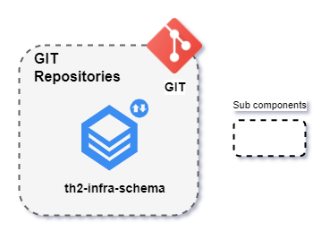

# Demo Step 2: Publishing th2-infra-schema

In this step, you will create the following fragment of the final th2 environment:



## th2-infra-schema

**th2-infra-schema** is a repository containing the description of th2 components and links between them.

Some example configurations of th2 are available in different branches of the [`th2-infra-schema-demo`](https://github.com/th2-net/th2-infra-schema-demo/tree/master) repository.

See the [Theory of pins and links](https://github.com/th2-net/th2-documentation/wiki/infra:-Theory-of-Pins-and-Links) section of the th2 GitHub Wiki for more information.

## Publish th2-infra-schema

Fork the [`th2-infra-schema-demo`](https://github.com/th2-net/th2-infra-schema-demo/tree/master) repository or use it as a template. It can be either **public** or **private**.


{}
th2 will sync with this published `th2-infra-schema` using `ssh`. 
In the future, you will provide the link to this repository in a separate th2 configuration (will be discussed in one of the subsequent steps).
{}

## Alternative: Publish th2-infra-schema to create a th2 environment via the GUI

### Download th2-infra-schema

Clone the needed branch of [`th2-infra-schema-demo`](https://github.com/th2-net/th2-infra-schema-demo/tree/master) (each branch of the Git repository contains a version of `th2-infra-schema`). Currently, [`ver-1.5.4-main_scenario`](https://github.com/th2-net/th2-infra-schema-demo/tree/ver-1.5.4-main_scenario) is the newest. 

```shell
git clone -b <branch_name> --single-branch https://github.com/th2-net/th2-infra-schema-demo.git
```
The contents of this repository should be placed into the th2 repository.

Open the `infra-mgr-config.yml` file. The `spec.k8s-propagation` variable should be set to 'sync' instead of 'off' in order to automatically inherit all dependencies from **th2-infra-schema**.

```yml
kind: SettingsFile
metadata:
  name: infra-mgr-config
spec:
  k8s-propagation: sync
```

### Publish the Git repository

Reinitialize the repository to set the downloaded branch as `main`.

```shell
rm -rf .git
git init
```

Publish your repository on GitHub as either **public** or **private**.

## Result

As a result of this and the previous steps, you should have the following part of the th2 framework ready:


