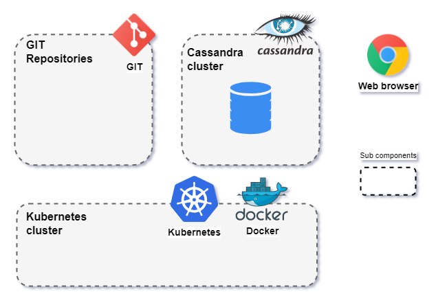

Install required software to the test-box and operator-box.

During this step you will create next components for final schema:
1. [Docker](#1-docker-ce-v19)
2. [Kubernetes cluster](#3-kubernetes-cluster)
3. Cassandra database cluster
4. [GIT](#1-git)
5. [Web browser](#4-chrome-75-or-newer)



## Test box (th2 node)

th2 is a Kubernetes-driven microservices solution. 
So, to start with th2 you would need the fully functional 
Kubernetes cluster installed on your test-box/test-boxes 
(a quick guide for kubernetes installation on Centos-7 is 
available in the [FAQ section](https://github.com/th2-net/th2-documentation/wiki/Centos-7-kubernetes-and-cassandra-installation-guide)), please also check if your 
test-box and operator-box meet th2 software [requirements](https://d0rich.github.io/th2-docs/getting-started/requirements/).

### 1. Docker CE v19+  

   Docker is the most popular open source application containerize technology. Th2 services will run inside separate docker containers.

   To install, follow the [official guide](https://docs.docker.com/engine/install/). Also, be sure to [configure docker](https://kubernetes.io/docs/setup/production-environment/container-runtimes/#docker) for kubernetes.

{}
Check status of the docker process
```shell
sudo docker run hello-world
```
Output example
```shell
Hello from Docker!
This message shows that your installation appears to be working correctly.

To generate this message, Docker took the following steps:
 1. The Docker client contacted the Docker daemon.
 2. The Docker daemon pulled the "hello-world" image from the Docker Hub.
    (amd64)
 3. The Docker daemon created a new container from that image which runs the
    executable that produces the output you are currently reading.
 4. The Docker daemon streamed that output to the Docker client, which sent it
    to your terminal.

To try something more ambitious, you can run an Ubuntu container with:
 $ docker run -it ubuntu bash

Share images, automate workflows, and more with a free Docker ID:
 https://hub.docker.com/

For more examples and ideas, visit:
 https://docs.docker.com/get-started/
```
{}

### 2. kubelet, kubeadm, kubectl v1.19.x - 1.20.x

Kubernetes is an open source, automated management system for containerized applications. In our case, docker containers.

Kubelet is the service that powers the kubernetes.

Kubeadm is a set of tools for creating and managing a kubernetes cluster.

Kubectl is a command line interface for interacting with the kubernetes cluster.

Instructions for installing these 3 tools are given in the official kubernetes [guide](https://kubernetes.io/docs/setup/production-environment/tools/kubeadm/install-kubeadm/).

{}
Check if kubelet service running:
```shell
systemctl status kubelet
```
Output example:
```shell
● kubelet.service - kubelet: The Kubernetes Node Agent
     Loaded: loaded (/lib/systemd/system/kubelet.service; enabled; vendor preset: enabled)
    Drop-In: /etc/systemd/system/kubelet.service.d
             └─10-kubeadm.conf
     Active: inactive (dead) (Result: exit-code) since Fri 2021-09-17 14:26:40 MSK; 1 weeks 3 days ago
       Docs: https://kubernetes.io/docs/home/
   Main PID: 3355568 (code=exited, status=255/EXCEPTION)
```

Check kubectl version and kubeadm version:
```shell
kubectl version
kubeadm version
```

Output example:
```shell
$ kubectl version
Client Version: version.Info{Major:"1", Minor:"22", GitVersion:"v1.22.2", GitCommit:"8b5a19147530eaac9476b0ab82980b4088bbc1b2", GitTreeState:"clean", BuildDate:"2021-09-15T21:38:50Z", GoVersion:"go1.16.8", Compiler:"gc", Platform:"linux/amd64"}
Server Version: version.Info{Major:"1", Minor:"19", GitVersion:"v1.19.14", GitCommit:"0fd2b5afdfe3134d6e1531365fdb37dd11f54d1c", GitTreeState:"clean", BuildDate:"2021-08-11T18:02:17Z", GoVersion:"go1.15.15", Compiler:"gc", Platform:"linux/amd64"}
$ kubeadm version
kubeadm version: &version.Info{Major:"1", Minor:"20", GitVersion:"v1.20.9", GitCommit:"7a576bc3935a6b555e33346fd73ad77c925e9e4a", GitTreeState:"clean", BuildDate:"2021-07-15T21:00:30Z", GoVersion:"go1.15.14", Compiler:"gc", Platform:"linux/amd64"}
```
{}

### 3. Kubernetes cluster

{}
Minikube can be installed as an alternative to **2. kubelet, kubeadm, kubectl** and **3. Kubernetes cluster**.
Minikube runs kubernetes cluster inside container.
Minikube is easier to configure, but it can't expand cluster to several nodes.
Instructions for installing minikube are given in the official kubernetes [guide](https://minikube.sigs.k8s.io/docs/start/)
{}

{}

It is possible to specify kubernetes cluster version before running it.

```shell
minikube start --kubernetes-version v1.19.14
```
{}

The th2 modules will run on the kubernetes cluster. Use the official [guide](https://kubernetes.io/docs/setup/production-environment/tools/kubeadm/create-cluster-kubeadm/) to create a cluster.

{}
Check cluster information:
```shell
kubectl cluster-info
```
Output example:
```shell
Kubernetes control plane is running at https://192.168.49.2:8443
KubeDNS is running at https://192.168.49.2:8443/api/v1/namespaces/kube-system/services/kube-dns:dns/proxy

To further debug and diagnose cluster problems, use 'kubectl cluster-info dump'.
```
{}

### 4. Flannel CNI

Flannel is an add-on for kubernetes that addresses networking [issues](https://kubernetes.io/docs/concepts/cluster-administration/networking/).

To install, you need to run the following command

```shell
kubectl apply -f https://raw.githubusercontent.com/coreos/flannel/master/Documentation/kube-flannel.yml
```
{}
Get Flannel pod:
```shell
kubectl get pods -l app=flannel -n kube-system
```
Output example:
```shell
NAME                    READY   STATUS    RESTARTS   AGE
kube-flannel-ds-g4tmx   1/1     Running   0          41d
```
{}
## Operator box

### 1. GIT

GIT is the most popular project version control system. Th2 will keep track of the git repositories of modules and update its configuration when they change.

Follow [these instructions](https://git-scm.com/book/en/v2/Getting-Started-Installing-Git) to install.

{}
Check GIT version:
```shell
git --version
```
Output example:
```shell
git version 2.33.0
```
{}

### 2. Kubectl

Kubectl is a command line interface for interacting with the kubernetes cluster.

Installation instructions are given on the [kubernetes website](https://kubernetes.io/docs/tasks/tools/).

{}
Check kubectl version:
```shell
kubectl version
```
Output example:
```shell
Client Version: version.Info{Major:"1", Minor:"22", GitVersion:"v1.22.2", GitCommit:"8b5a19147530eaac9476b0ab82980b4088bbc1b2", GitTreeState:"clean", BuildDate:"2021-09-15T21:38:50Z", GoVersion:"go1.16.8", Compiler:"gc", Platform:"linux/amd64"}
Server Version: version.Info{Major:"1", Minor:"19", GitVersion:"v1.19.14", GitCommit:"0fd2b5afdfe3134d6e1531365fdb37dd11f54d1c", GitTreeState:"clean", BuildDate:"2021-08-11T18:02:17Z", GoVersion:"go1.15.15", Compiler:"gc", Platform:"linux/amd64"}
```
{}

### 3. Helm 3+

Helm is a package manager for kubernetes. With it, you can very quickly install the required module into the kubernetes cluster.

[Official installation guide](https://helm.sh/docs/intro/install/).

{}
Check Helm version:
```shell
helm version
```
Output example:
```shell
version.BuildInfo{Version:"v3.6.0", GitCommit:"7f2df6467771a75f5646b7f12afb408590ed1755", GitTreeState:"clean", GoVersion:"go1.16.3"}
```
{}

### 4. Chrome 75 or newer

Chrome browser is required to access the web interface kubernetes dashboard, grafana, etc.

To install, follow the [instruction](https://www.google.com/chrome).
