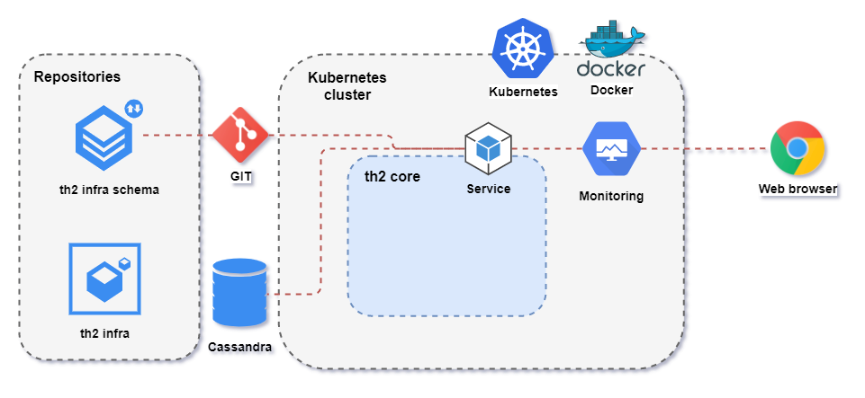

At the end of this step, your environment schema is expected to be like in the diagram below.



## Step 1. Create namespaces

Create namespaces for monitoring and th2 service tools.

```shell
kubectl create namespace monitoring
kubectl create namespace service
```

Output example:
```shell
namespace/monitoring created
namespace/service created
```

{}
Get namespaces list:
```shell
kubectl get namespaces
```
Output example:
```shell
NAME              STATUS   AGE
default           Active   41d
kube-node-lease   Active   41d
kube-public       Active   41d
kube-system       Active   41d
monitoring        Active   41d
service           Active   41d
```
{}

## Step 2. Data persistence

Data persistence is required for the following components: Grafana, Prometheus,
Loki, RabbitMQ - and should be set up at this step.

{}
Examples below use HostPath type of
[Persistent Volume(PV)](https://kubernetes.io/docs/concepts/storage/persistent-volumes/).
Please read the documentation to choose an appropriate PV type for your environment.
{}

### Create directories for data persistence

{}
If you are using _minikube_, create directories inside it. To do this, connect to the minikube container with
`minikube ssh` and execute next command.
{}

The following command can require root permissions, create directory on th2 node:
```shell
mkdir /opt/grafana /opt/prometheus /opt/loki /opt/rabbitmq
```

### Edit persistence volume configuration
Set node name in `pvs.yaml` (replace **\<node-name\>**)  
`pvs.yaml` example:
```yaml
---
apiVersion: v1
kind: PersistentVolume
metadata:
  name: storage-loki
  labels:
    app: loki
spec:
  capacity:
    storage: 5Gi
  volumeMode: Filesystem
  accessModes:
    - ReadWriteOnce
  persistentVolumeReclaimPolicy: Retain
  storageClassName: local-storage
  local:
    path: /opt/loki
  nodeAffinity:
    required:
      nodeSelectorTerms:
        - matchExpressions:
            - key: kubernetes.io/hostname
              operator: In
              values:
                - <node-name> # replace with node name
---
```

### Create kubernetes entities for data persistence

{}
Make sure that you are located in the `th2-infra/example-values` directory.
{}

Create PVs and PVCs:

```shell
kubectl apply -f ./pvs.yaml
kubectl apply -f ./pvcs.yaml
```

{}
Get list of pv's:
```shell
kubectl get persistentvolumes
```
Output example:
```shell
NAME                 CAPACITY   ACCESS MODES   RECLAIM POLICY   STATUS     CLAIM                                                                                                               STORAGECLASS    REASON   AGE
components-storage   10Gi       RWX            Retain           Released   schema/components                                                                                                   local-storage            41d
storage-grafana      1Gi        RWO            Retain           Bound      monitoring/grafana                                                                                                  local-storage            41d
storage-loki         5Gi        RWO            Retain           Bound      monitoring/loki                                                                                                     local-storage            41d
storage-prometheus   5Gi        RWO            Retain           Bound      monitoring/prometheus-prometheus-kube-prometheus-prometheus-db-prometheus-prometheus-kube-prometheus-prometheus-0                            41d
storage-rabbitmq     10Gi       RWO            Retain           Bound      service/data-rabbitmq-0                                                                                             local-storage            41d
```

Get list of pvc's:
```shell
kubectl get persistentvolumeclaims --all-namespaces
```
Output example:
```shell
NAMESPACE    NAME                                                                                                     STATUS   VOLUME               CAPACITY   ACCESS MODES   STORAGECLASS    AGE
monitoring   grafana                                                                                                  Bound    storage-grafana      1Gi        RWO            local-storage   41d
monitoring   loki                                                                                                     Bound    storage-loki         5Gi        RWO            local-storage   41d
monitoring   prometheus-prometheus-kube-prometheus-prometheus-db-prometheus-prometheus-kube-prometheus-prometheus-0   Bound    storage-prometheus   5Gi        RWO                            41d
service      data-rabbitmq-0                                                                                          Bound    storage-rabbitmq     10Gi       RWO            local-storage   41d
```
{}


## Step 3. Configure th2

Once all of the required software is installed on your test-box and operator-box and
th2-infra repositories are ready, you can start configuring the cluster.


{}
Make sure that you are located in the `th2-infra/example-values` directory.
{}


### Define Grafana and Dashboard host names

{}
Host name must be resolved from QA boxes.
{}

Define Dashboard host name in the `dashboard.values.yaml` ([file in github](https://github.com/th2-net/th2-infra/blob/master/example-values/prometheus-operator.values.yaml)):

```yaml
ingress:
  hosts:
    - <th2_host_name>
```
Define Grafana host names in the `prometheus-operator.values.yaml` ([file in github](https://github.com/th2-net/th2-infra/blob/master/example-values/prometheus-operator.values.yaml)):
```yaml
grafana:
  ingress:
    hosts:
      - <th2_host_name>
```


### Access for infra-mgr th2 schema git repository:

`Ssh` access with write permissions is required by th2-infra-mgr component.

{}
Be sure you are located in the `th2-infra/example-values` directory.
{}

Generate keys without passphrase
```shell
ssh-keygen -t rsa -m pem -f ./infra-mgr-rsa.key
```
[Add a new SSH key to your GitHub account](https://docs.github.com/en/free-pro-team@latest/github/authenticating-to-github/adding-a-new-ssh-key-to-your-github-account)

Create infra-mgr secret from the private key:
```shell
kubectl -n service create secret generic infra-mgr --from-file=infra-mgr=./infra-mgr-rsa.key
```

### Set the repository with schema configuration

Set _infraMgr.git.repository_ value in the
`service.values.yaml` ([file on github](https://github.com/th2-net/th2-infra/blob/master/example-values/service.values.yaml))
to ssh link of your schema repository, e.g:

```yaml
infraMgr:
  git:
    repository: git@github.com:th2-net/th2-infra-demo-configuration.git
```

### Define cassandra host name

Set _cassandra.host_ value for cassandra in the `service.values.yaml` ([file on github](https://github.com/th2-net/th2-infra/blob/master/example-values/service.values.yaml)).
```yaml
cassandra:
  internal: false
  host: <cassandra-host>
```

### Define th2 ingress hostname

If required, add the _ingress.hostname_ value into the
`service.values.yaml` ([file on github](https://github.com/th2-net/th2-infra/blob/master/example-values/service.values.yaml)).
Otherwise, th2 http services will be available on node IP address.

### Create secret with th2 credentials

Create `secrets.yaml` in the `th2-infra` folder.

{}
Do not commit `secrets.yaml` into git.
{}

Example:
```yaml
# required only for images from a private registry, will be attached as the first PullSecret to deployments
#productRegistry:
#  username: user
#  password: password
#  name: private-registry-1.example.com # core components registry

# required only for images from a private registry, will be attached as the second PullSecret to deployments
#solutionRegistry:
#  username: user
#  password: password
#  name: private-registry-2.example.com # components registry

# required only for images from a private registry, will be attached as the third PullSecret to deployments
#proprietaryRegistry:
#  username: user
#  password: password
#  name: private-registry-3.example.com # components registry

cassandra:
# set credentials for the existing Cassandra cluster
  dbUser:
    user: <user-name>
    password: <password>

rabbitmq:
# set admin user credentials, it will be created during deployment
  rabbitmqUsername: th2
  rabbitmqPassword: rab-pass
  # must be random string
  rabbitmqErlangCookie: cookie
```

## Step 4. Deploy th2

{}
Make sure that you are located in the `th2-infra/example-values` directory.
{}

### Install helm-operator

Download helm-operator repository locally

```shell
helm repo add fluxcd https://charts.fluxcd.io
```

Install helm-operator

```shell
helm install --version=1.2.0 helm-operator -n service fluxcd/helm-operator -f ./helm-operator.values.yaml
```

{}
Get helm operator deployment:
```shell
kubectl get deployment -n service -l app=helm-operator
```
Output example:
```shell
NAME            READY   UP-TO-DATE   AVAILABLE   AGE
helm-operator   1/1     1            1           40d
```
{}

### Install NGINX Ingress Controller
Download NGINX Ingress Controller repository locally
```shell
helm repo add ingress-nginx https://kubernetes.github.io/ingress-nginx
```
Install NGINX Ingress Controller
```shell
helm install -n service --version=3.31.0 ingress ingress-nginx/ingress-nginx -f ./ingress.values.yaml
```

{}
Get helm operator deployment:
```shell
kubectl get deployment -n service -l app.kubernetes.io/name=ingress-nginx
```
Output example:
```shell
NAME                               READY   UP-TO-DATE   AVAILABLE   AGE
ingress-ingress-nginx-controller   1/1     1            1           41d
```
{}

### Install Prometheus

Download Prometheus repository locally

```shell
helm repo add prometheus-community https://prometheus-community.github.io/helm-charts
```

Install Prometheus

```shell
helm install --version=15.0.0 prometheus -n monitoring prometheus-community/kube-prometheus-stack -f ./prometheus-operator.values.yaml
```

{}
Get dashboard pod:
```shell
kubectl get pod -n monitoring -l app=kube-prometheus-stack-operator
```
Output example:
```shell
NAME                                                   READY   STATUS    RESTARTS   AGE
prometheus-kube-prometheus-operator-584874d66c-td4hc   1/1     Running   0          41d
```
{}

### Install th2-infra components in the service namespace

Download th2 repository locally

```shell
helm repo add th2 https://th2-net.github.io
```

Install th2


{}
Replace with the th2-infra release version you need, please follow https://github.com/th2-net/th2-infra/releases
{}
```shell
helm install -n service --version=<version> th2-infra th2/th2 -f ./service.values.yaml -f ./secrets.yaml
```

### Install Kubernetes Dashboard

Download [Kubernetes Dashboard](https://kubernetes.io/docs/tasks/access-application-cluster/web-ui-dashboard/) repository locally

```shell
helm repo add kubernetes-dashboard https://kubernetes.github.io/dashboard/
```

Install Kubernetes Dashboard

```shell
helm install dashboard -n monitoring kubernetes-dashboard/kubernetes-dashboard -f ./dashboard.values.yaml
```

{}
Get dashboard pod:
```shell
kubectl get pod -n monitoring -l app.kubernetes.io/name=kubernetes-dashboard
```
Output example:
```shell
NAME                                              READY   STATUS    RESTARTS   AGE
dashboard-kubernetes-dashboard-567678889f-2snh7   1/1     Running   0          40d
```
{}

### Install Grafana

Download Grafana repository locally

```shell
helm repo add grafana https://grafana.github.io/helm-charts
```

Install Grafana

```shell
helm install --version=0.40.1 loki -n monitoring grafana/loki-stack -f ./loki.values.yaml
```

{}
Get dashboard pod:
```shell
kubectl get pod -n monitoring -l app.kubernetes.io/name=grafana
```
Output example:
```shell
NAME                                  READY   STATUS    RESTARTS   AGE
prometheus-grafana-74ff7fcbd4-h2r8t   2/2     Running   0          41d
```
{}

### Check result
#### Pods
Check if service pods are running:
```shell
kubectl get pods -n service
```

Output example:
```shell
NAME                                               READY   STATUS    RESTARTS   AGE
helm-operator-79fc58f746-q8qwd                     1/1     Running   0          21d
infra-editor-7cd68c8587-q5tfp                      1/1     Running   0          20d
infra-mgr-67b65f4bb-gb4cc                          1/1     Running   0          20d
infra-operator-6b7987b55-zxxdt                     1/1     Running   0          20d
infra-repo-9c77fd6f7-xj9wf                         1/1     Running   0          20d
ingress-ingress-nginx-controller-b556b7cb5-gfrhl   1/1     Running   0          22d
rabbitmq-0                                         1/1     Running   0          21d
```

Check if monitoring pods are running
```shell
kubectl get pods -n monitoring
```
Output example:
```shell
NAME                                                     READY   STATUS    RESTARTS   AGE
........
pod/dashboard-kubernetes-dashboard-77d85586db-j9v8f      1/1     Running   0          56s
alertmanager-prometheus-prometheus-oper-alertmanager-0   2/2     Running   0          75s
loki-0                                                   1/1     Running   0          4m47s
loki-promtail-wqfml                                      1/1     Running   0          4m47s
prometheus-grafana-68f8dd6d57-2gtns                      2/2     Running   0          82s
prometheus-kube-state-metrics-75d4cc9dbd-psb88           1/1     Running   0          82s
prometheus-prometheus-node-exporter-gfzp6                1/1     Running   0          82s
prometheus-prometheus-oper-operator-df668d457-snxks      1/1     Running   0          82s
prometheus-prometheus-prometheus-oper-prometheus-0       3/3     Running   1          65s        
........
```
#### Access from browser

Check access to Grafana (the default `user/password: admin/prom-operator` must be changed):  
`http://your-host:30000/grafana/login`.

## Step 5. Check up installed services

{}
To get the cluster IP (your-host), execute the `kubectl cluster-info` command.
{}

- Kubernetes dashboard `http://your-host:30000/dashboard/`
- Grafana `http://your-host:30000/grafana/`
- th2-infra-editor `http://your-host:30000/editor/`
- RabbitMQ `http://your-host:30000/rabbitmq/`
- th2-reports `http://your-host:30000/your-namespace/`
